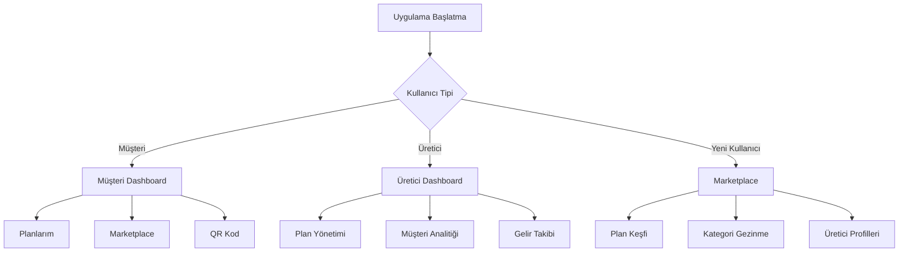

# 📱 BLIMOBIL - Ana Proje Vizyonu

## 🎯 Genel Vizyon
Kullanıcıların ve üreticilerin blockchain tabanlı planları mobil cihazlarından kolayca yönetebilecekleri, kimlik doğrulama yapabilecekleri ve NFT/kullanım haklarını takip edebilecekleri kapsamlı bir **çift taraflı** mobil uygulama geliştirmek.

## 🏢 Hedef Kullanıcı Grupları

### 👤 Son Kullanıcılar (Customers)
- Plan satın alma ve yönetimi
- NFT sahiplik kanıtı gösterme
- Kalan kullanım hakkı takibi
- QR kod ile offline kimlik doğrulama
- Planların durumu ve istatistikleri
- Marketplace'den yeni planlar keşfetme

### 🏭 Üreticiler (Producers)
- Plan oluşturma ve yönetimi
- Müşteri istatistikleri ve analitikleri
- Gelir takibi ve raporlama
- Müşteri etkileşimleri
- Plan performans analizi
- Mobil bildirimler ve uyarılar

### 🛒 Marketplace Özellikleri
- Tüm mevcut planları keşfetme
- Kategori bazlı filtreleme
- Arama ve sıralama
- Plan karşılaştırma
- Değerlendirme ve yorumlar
- Popüler planlar ve öneriler

## 🌟 Ana Değer Önerileri

### Kullanıcılar İçin
- **Tek Uygulamada Tüm Planlar**: Satın alınan tüm planlar tek yerde
- **Offline Kullanım**: İnternet olmadan kimlik doğrulama
- **Gerçek Zamanlı Takip**: Anlık kullanım ve ödeme bilgileri
- **Güvenli Kimlik**: Blockchain tabanlı güvenli doğrulama
- **Plan Keşfi**: Yeni hizmetleri kolayca bulma

### Üreticiler İçin
- **Mobil Yönetim**: Her yerden plan yönetimi
- **Anlık İstatistikler**: Gerçek zamanlı iş analitiği
- **Müşteri İletişimi**: Doğrudan kullanıcı etkileşimi
- **Pazarlama Araçları**: Plan tanıtımı ve pazarlama
- **Gelir Optimizasyonu**: Detaylı finansal takip

## 📊 Başarı Hedefleri

### Teknik Hedefler
- 99.9% uptime
- <3 saniye uygulama başlatma
- <2 saniye plan detayları yükleme
- 100% offline QR kod çalışma oranı

### İş Hedefleri
- İlk 6 ayda 1000+ aktif kullanıcı
- İlk yılda 100+ üretici
- %95+ kullanıcı memnuniyeti
- %20+ aylık büyüme oranı

## 🔄 Uygulama Akışı



## 🛠️ Teknoloji Stack Kararları

### Platform: React Native
**Seçim Sebepleri:**
- Cross-platform (iOS & Android)
- Mevcut TypeScript bilgisi transfer edilebilir
- Zengin blockchain kütüphane desteği
- Hızlı geliştirme döngüsü

### Alternatif Değerlendirmeler
| Platform | Artılar | Eksiler | Karar |
|----------|---------|---------|-------|
| React Native | Cross-platform, hızlı geliştirme | Performance sınırları | ✅ Seçildi |
| Flutter | Yüksek performance | Dart öğrenme eğrisi | ❌ |
| Native (iOS/Android) | En yüksek performance | İkili geliştirme maliyeti | ❌ |

## 📱 Uygulama Mimarisi

### Ana Modüller
1. **Authentication Module**: Wallet bağlantısı ve kimlik doğrulama
2. **Plan Management Module**: Plan CRUD işlemleri
3. **Marketplace Module**: Plan keşif ve satın alma
4. **NFT Module**: NFT görüntüleme ve yönetimi
5. **QR Code Module**: Offline kimlik doğrulama
6. **Analytics Module**: İstatistik ve raporlama
7. **Notification Module**: Push ve local bildirimler
8. **Sync Module**: Blockchain ve backend senkronizasyonu

### Veri Akışı
```
Blockchain ←→ Backend API ←→ Mobile App ←→ Local Storage
     ↑              ↑              ↑           ↑
   Smart         Database      React        AsyncStorage
  Contracts                    Native       SecureStorage
```

## 🎨 Tasarım Prensipleri

### UI/UX Prensipleri
- **Minimalizm**: Sade ve anlaşılır arayüz
- **Tutarlılık**: Tüm platformlarda aynı deneyim
- **Erişilebilirlik**: Engelli kullanıcılar için uygun
- **Performance**: Hızlı ve akıcı etkileşim

### Kullanıcı Deneyimi
- Maksimum 3 dokunuşla istenen işlem
- Açık ve anlaşılır hata mesajları
- Görsel geri bildirimler
- Offline kullanım desteği

## 📈 Geliştirme Metodolojisi

### Agile Yaklaşım
- 2 haftalık sprint'ler
- Haftalık demo'lar
- Sürekli kullanıcı geri bildirimi
- MVP yaklaşımı

### Kalite Güvence
- Unit testler (%80+ coverage)
- Integration testler
- UI/UX testleri
- Security audit'leri

## 🚀 Go-to-Market Stratejisi

### Faz 1: Soft Launch (Beta)
- Mevcut Blicence kullanıcıları
- 50 beta tester
- Temel özellikler

### Faz 2: Public Launch
- App Store ve Google Play yayını
- Pazarlama kampanyası
- Influencer iş birlikleri

### Faz 3: Scale
- Yeni özellikler
- Uluslararası genişleme
- B2B partnerships

Bu doküman, projenin genel vizyonunu ve stratejik yaklaşımını belirler. Sonraki dosyalarda teknik detaylar ve implementasyon planları ele alınacaktır.
