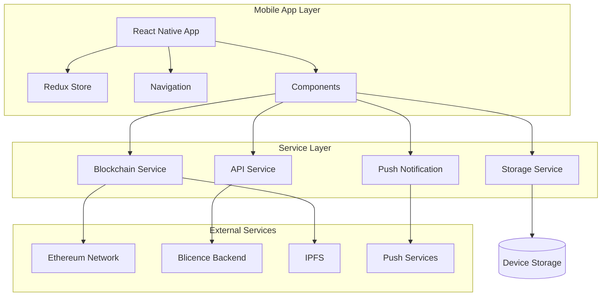

# 🏗️ 02 - Teknik Mimari ve Platform Seçimi

## 🎯 Mimari Kararları

### Platform Seçimi: React Native

#### Seçim Kriterleri
| Kriter | React Native | Flutter | Native |
|--------|-------------|---------|--------|
| **Geliştirme Hızı** | ✅ Yüksek | ✅ Yüksek | ❌ Düşük |
| **Maliyet** | ✅ Düşük | ✅ Düşük | ❌ Yüksek |
| **Performance** | ⚠️ İyi | ✅ Çok İyi | ✅ Mükemmel |
| **Ekosistem** | ✅ Zengin | ⚠️ Gelişiyor | ✅ Mature |
| **Mevcut Bilgi** | ✅ TypeScript/React | ❌ Dart öğrenmeli | ⚠️ 2x Geliştirme |
| **Blockchain Desteği** | ✅ ethers.js, web3 | ⚠️ Sınırlı | ✅ Native libs |
| **Topluluk** | ✅ Büyük | ✅ Büyüyor | ✅ Büyük |

**Sonuç**: React Native seçildi çünkü:
- Mevcut TypeScript bilgisi transfer edilebilir
- Blockchain kütüphaneleri zengin
- Hızlı MVP geliştirme
- Cross-platform maliyet avantajı

## 🏛️ Sistem Mimarisi

### Genel Mimari Şeması


### Katmanlı Mimari

#### 1. Presentation Layer (Sunum Katmanı)
```typescript
// React Native Components ve Screens
src/
├── screens/           // Ekran komponenlleri
├── components/        // Yeniden kullanılabilir UI komponentleri
├── navigation/        // Navigasyon yapılandırması
└── theme/            // Tasarım sistem dosyaları
```

#### 2. Business Logic Layer (İş Mantığı Katmanı)
```typescript
// Redux Store ve Middleware
src/
├── store/
│   ├── slices/       // Redux Toolkit slices
│   ├── middleware/   // Custom middleware
│   └── selectors/    // Reselect selectors
└── hooks/            // Custom React hooks
```

#### 3. Service Layer (Servis Katmanı)
```typescript
// API ve Blockchain servisleri
src/
├── services/
│   ├── blockchain/   // Ethereum etkileşimi
│   ├── api/         // Backend API calls
│   ├── storage/     // Local storage management  
│   ├── push/        // Push notifications
│   └── sync/        // Data synchronization
```

#### 4. Data Layer (Veri Katmanı)
```typescript
// Veri modelleri ve tipları
src/
├── types/           // TypeScript type definitions
├── models/          // Data models
└── utils/           // Helper functions
```

## 🔧 Teknoloji Stack Detayları

### Frontend Framework
```json
{
  "react-native": "^0.72.0",
  "@react-navigation/native": "^6.1.0",
  "@react-navigation/bottom-tabs": "^6.5.0",
  "@react-navigation/stack": "^6.3.0"
}
```

### State Management
```json
{
  "@reduxjs/toolkit": "^1.9.0",
  "react-redux": "^8.1.0",
  "redux-persist": "^6.0.0",
  "reselect": "^4.1.0"
}
```

### Blockchain Integration
```json
{
  "ethers": "^6.7.0",
  "@walletconnect/react-native-v2": "^2.10.0",
  "@superfluid-finance/sdk-core": "^0.6.0",
  "react-native-keychain": "^8.1.0"
}
```

### UI/UX Libraries
```json
{
  "react-native-reanimated": "^3.5.0",
  "react-native-gesture-handler": "^2.12.0",
  "react-native-svg": "^13.4.0",
  "react-native-linear-gradient": "^2.8.0",
  "react-native-vector-icons": "^10.0.0"
}
```

### QR Code ve Camera
```json
{
  "react-native-qrcode-generator": "^1.4.0",
  "react-native-qrcode-scanner": "^1.5.0",
  "react-native-camera": "^4.2.0"
}
```

### Storage ve Güvenlik
```json
{
  "@react-native-async-storage/async-storage": "^1.19.0",
  "react-native-keychain": "^8.1.0",
  "react-native-biometrics": "^3.0.0",
  "react-native-crypto": "^2.2.0"
}
```

### Push Notifications
```json
{
  "@react-native-firebase/messaging": "^18.5.0",
  "react-native-push-notification": "^10.1.0"
}
```

## 📁 Proje Dosya Yapısı

```
blimobil/
├── README.md
├── package.json
├── tsconfig.json
├── metro.config.js
├── babel.config.js
├── jest.config.js
├── .env.example
├── ios/
│   ├── Podfile
│   └── BlimobilApp/
├── android/
│   ├── build.gradle
│   └── app/
└── src/
    ├── App.tsx
    ├── types/
    │   ├── index.ts
    │   ├── plans.ts
    │   ├── users.ts
    │   ├── blockchain.ts
    │   └── api.ts
    ├── components/
    │   ├── common/
    │   │   ├── Button/
    │   │   ├── Input/
    │   │   ├── Card/
    │   │   ├── Modal/
    │   │   └── LoadingSpinner/
    │   ├── plans/
    │   │   ├── PlanCard/
    │   │   ├── PlanList/
    │   │   ├── PlanDetail/
    │   │   └── PlanFilters/
    │   ├── marketplace/
    │   │   ├── CategoryGrid/
    │   │   ├── SearchBar/
    │   │   ├── ProducerCard/
    │   │   └── FeaturedPlans/
    │   ├── producer/
    │   │   ├── Dashboard/
    │   │   ├── Analytics/
    │   │   ├── CustomerList/
    │   │   └── PlanManager/
    │   ├── nft/
    │   │   ├── NFTViewer/
    │   │   └── NFTGallery/
    │   ├── qr/
    │   │   ├── QRGenerator/
    │   │   ├── QRScanner/
    │   │   └── QRVerifier/
    │   └── wallet/
    │       ├── WalletConnector/
    │       ├── WalletInfo/
    │       └── TokenBalance/
    ├── screens/
    │   ├── auth/
    │   │   ├── WelcomeScreen.tsx
    │   │   ├── OnboardingScreen.tsx
    │   │   └── WalletConnectScreen.tsx
    │   ├── customer/
    │   │   ├── DashboardScreen.tsx
    │   │   ├── MyPlansScreen.tsx
    │   │   ├── PlanDetailScreen.tsx
    │   │   └── UsageHistoryScreen.tsx
    │   ├── marketplace/
    │   │   ├── MarketplaceScreen.tsx
    │   │   ├── CategoryScreen.tsx
    │   │   ├── SearchResultsScreen.tsx
    │   │   ├── ProducerProfileScreen.tsx
    │   │   └── PlanPreviewScreen.tsx
    │   ├── producer/
    │   │   ├── ProducerDashboardScreen.tsx
    │   │   ├── ManagePlansScreen.tsx
    │   │   ├── CreatePlanScreen.tsx
    │   │   ├── CustomersScreen.tsx
    │   │   ├── AnalyticsScreen.tsx
    │   │   └── RevenueScreen.tsx
    │   ├── qr/
    │   │   ├── QRCodeScreen.tsx
    │   │   └── QRScannerScreen.tsx
    │   └── settings/
    │       ├── SettingsScreen.tsx
    │       ├── ProfileScreen.tsx
    │       ├── WalletSettingsScreen.tsx
    │       └── NotificationSettingsScreen.tsx
    ├── navigation/
    │   ├── AppNavigator.tsx
    │   ├── AuthNavigator.tsx
    │   ├── CustomerTabNavigator.tsx
    │   ├── ProducerTabNavigator.tsx
    │   └── StackNavigators.tsx
    ├── store/
    │   ├── index.ts
    │   ├── slices/
    │   │   ├── authSlice.ts
    │   │   ├── customerSlice.ts
    │   │   ├── producerSlice.ts
    │   │   ├── plansSlice.ts
    │   │   ├── marketplaceSlice.ts
    │   │   ├── walletSlice.ts
    │   │   └── settingsSlice.ts
    │   ├── middleware/
    │   │   ├── syncMiddleware.ts
    │   │   ├── loggingMiddleware.ts
    │   │   └── errorMiddleware.ts
    │   └── selectors/
    │       ├── authSelectors.ts
    │       ├── plansSelectors.ts
    │       └── marketplaceSelectors.ts
    ├── services/
    │   ├── blockchain/
    │   │   ├── WalletService.ts
    │   │   ├── ContractService.ts
    │   │   ├── SuperfluidService.ts
    │   │   └── TransactionService.ts
    │   ├── api/
    │   │   ├── BlicenceAPI.ts
    │   │   ├── MarketplaceAPI.ts
    │   │   ├── ProducerAPI.ts
    │   │   └── AnalyticsAPI.ts
    │   ├── storage/
    │   │   ├── AsyncStorageService.ts
    │   │   ├── SecureStorageService.ts
    │   │   └── CacheService.ts
    │   ├── push/
    │   │   ├── PushNotificationService.ts
    │   │   └── LocalNotificationService.ts
    │   ├── qr/
    │   │   ├── QRCodeService.ts
    │   │   └── SignatureService.ts
    │   └── sync/
    │       ├── DataSyncService.ts
    │       └── RealtimeService.ts
    ├── utils/
    │   ├── constants.ts
    │   ├── helpers.ts
    │   ├── formatters.ts
    │   ├── validators.ts
    │   └── permissions.ts
    ├── hooks/
    │   ├── useWallet.ts
    │   ├── usePlans.ts
    │   ├── useMarketplace.ts
    │   ├── useProducer.ts
    │   └── useNotifications.ts
    ├── theme/
    │   ├── colors.ts
    │   ├── spacing.ts
    │   ├── typography.ts
    │   ├── shadows.ts
    │   └── index.ts
    └── assets/
        ├── images/
        ├── icons/
        ├── fonts/
        └── animations/
```

## 🔧 Servis Mimarisi

### Blockchain Service Layer
```typescript
// Blockchain işlemleri için ana servis katmanı
interface IBlockchainService {
  wallet: IWalletService;
  contracts: IContractService;
  superfluid: ISuperfluidService;
  transactions: ITransactionService;
}

class BlockchainService implements IBlockchainService {
  constructor(
    public wallet: WalletService,
    public contracts: ContractService,
    public superfluid: SuperfluidService,
    public transactions: TransactionService
  ) {}
}
```

### API Service Layer
```typescript
// Backend API işlemleri için servis katmanı
interface IAPIService {
  auth: IAuthAPI;
  marketplace: IMarketplaceAPI;
  producer: IProducerAPI;
  analytics: IAnalyticsAPI;
}

class APIService implements IAPIService {
  constructor(
    public auth: AuthAPI,
    public marketplace: MarketplaceAPI,
    public producer: ProducerAPI,
    public analytics: AnalyticsAPI
  ) {}
}
```

### Storage Service Layer
```typescript
// Veri saklama işlemleri için servis katmanı
interface IStorageService {
  secure: ISecureStorage;
  cache: ICacheStorage;
  async: IAsyncStorage;
}

class StorageService implements IStorageService {
  constructor(
    public secure: SecureStorageService,
    public cache: CacheService,
    public async: AsyncStorageService
  ) {}
}
```

## 🛡️ Güvenlik Mimarisi

### Güvenlik Katmanları
1. **Network Security**: HTTPS, Certificate Pinning
2. **Authentication**: Wallet-based auth, Biometric
3. **Data Security**: Encryption at rest, Secure storage
4. **Transaction Security**: Multi-signature, Gas optimization
5. **API Security**: JWT tokens, Rate limiting

### Güvenlik Servisleri
```typescript
interface ISecurityService {
  encryption: IEncryptionService;
  authentication: IAuthenticationService;
  keyManagement: IKeyManagementService;
  biometric: IBiometricService;
}
```

## 📊 Performans Optimizasyonu

### Rendering Optimizasyonu
- React.memo kullanımı
- useMemo ve useCallback hooks
- FlatList optimizasyonu
- Image lazy loading

### Network Optimizasyonu
- Request batching
- Response caching
- Offline-first yaklaşım
- Progressive data loading

### Storage Optimizasyonu
- Selective persistence
- Data compression
- Cache invalidation
- Background sync

Bu mimari, scalable, maintainable ve secure bir mobil uygulama geliştirmek için sağlam bir temel oluşturur.
